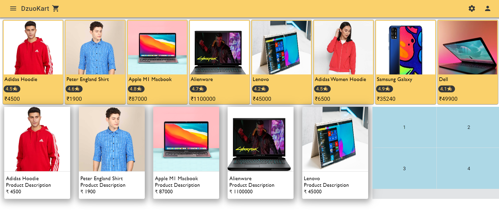
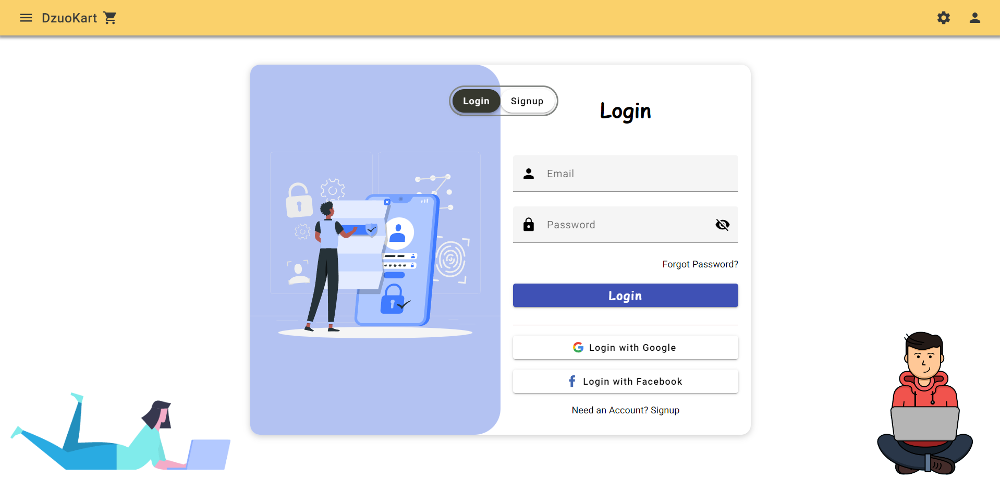

# DzuoKart

An E-Commerce Site.

## Table of Contents

- [Overview](#overview)
- [Demo](#demo)
- [Features](#features)
- [Getting Started](#getting-started)
  - [Prerequisites](#prerequisites)
  - [Installation](#installation)
- [Usage](#usage)
- [Contributing](#contributing)
- [License](#license)
- [Acknowledgements](#acknowledgements)

## Overview

DzuoKart is an E-com application built using Angular, Node.js, Express.js offering a visually appealing and interactive user experience. 

## Demo

Coming Soon

## Features

Coming Soon

- Feature 1
- Feature 2
- Feature 3

## Getting Started

Explain how users can get started with your project. Provide clear instructions on how to install and set up your project.

### Prerequisites

List any prerequisites that users need to have installed or set up before they can use your project. For example:

- Node.js and npm
- Angular CLI

### Installation

Follow step-by-step installation instructions mentioned below:

```bash
# Clone the repository
git clone https://github.com/Jvishal454/dzuokart.git

# Change to the project directory
cd yourproject

# Change to the client directory & Install
cd client

# Install dependencies
npm install

# Change to the server directory & Install
cd server

# Install dependencies
npm install

#Run in client directory
npm run dev

#Run in server directory
npm run dev

```
### Screen from the web app




